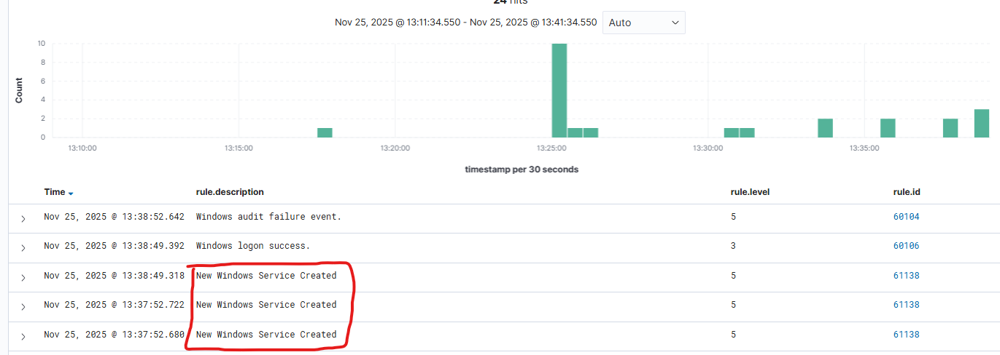

# Home-SOC-Wazuh-Sysmon-Detection-Lab
Threat Detection Lab using Wazuh SIEM, Sysmon, and Kali Linux
# 🛡️ Home SOC Project – Wazuh + Sysmon + Kali Linux  
**Threat Detection | Incident Response | MITRE ATT&CK Mapping**

This project simulates real-world attack behavior in a controlled home lab using Wazuh SIEM and Sysmon to detect and analyze malicious events across multiple techniques.  
It includes brute force attacks, PowerShell misuse, malware staging, persistence mechanisms, and privilege escalation attempts.

---

# 🏗️ Lab Architecture

```
Kali Linux (Attacker)
       ↓  (Simulated Attacks)
Windows 11 Endpoint (Sysmon + Wazuh Agent)
       ↓
Wazuh SIEM (Ubuntu Server)
       ↓
Wazuh Dashboard / MITRE ATT&CK Mapping
```

---

# 📦 Tools Used
- **Wazuh SIEM** (server, indexer, dashboard)
- **Sysmon v15+** (process, network, file telemetry)
- **Windows Event Logging**
- **Kali Linux** (Hydra, PowerShell payloads, malware simulation)
- **MITRE ATT&CK Navigator**

---

# 🚨 **Attack Scenarios & Detections**

Below are all 6 attack simulations with screenshots and MITRE mappings.

---

# 🟦 Scenario 1 — Unauthorized Software Installation  
**Goal:** Detect installation of a legitimate application generating suspicious service activity.  
**Technique:** *T1059 – Execution*, *T1543 – Service Installation*

### 📸 Screenshots
#### Wazuh Agent Overview  


#### Alerts (Filtered View)  


#### Event JSON  


#### Executable File Creation  


#### Installation Execution  


#### Windows Event Log  


---

# 🟩 Scenario 2 — Hydra RDP Brute Force Attack  
**Goal:** Detect repeated failed authentication attempts and account compromise.  
**Technique:** *T1110 – Brute Force*, *T1078 – Valid Accounts*

### 📸 Screenshots
#### Hydra Attack Execution  


#### MITRE T1110 Mapping  


#### Windows Admin Terminal  


#### Wazuh Brute Force Alerts  


#### Windows Machine IP  


---

# 🟥 Scenario 3 — PowerShell Attack (Encoded Commands)  
**Goal:** Detect malicious PowerShell activity, encoded commands, payload execution.  
**Technique:** *T1059.001 – PowerShell*

### 📸 Screenshots
#### PowerShell Execution  


#### Encoded Command  


#### MITRE Mapping  


#### Wazuh Alerts  


---

# 🟨 Scenario 4 — File Integrity Monitoring (Malware Drop Simulation)  
**Goal:** Detect malware-like file writes and unauthorized changes.  
**Technique:** *T1565 – Data Manipulation*, *T1105 – Ingress Tool Transfer*

### 📸 Screenshots
#### File Modification Command  


#### Sysmon Event ID 11 (FileCreate)  


#### Sysmon Event ID 1  


#### MITRE Mapping  


#### Windows Security Log  


---

# 🟧 Scenario 5 — Privilege Escalation Attempt  
**Goal:** Detect elevated processes, UAC interaction, and privileged execution.  
**Technique:** *T1547 – Boot/Logon Autostart*, *T1055 – Process Injection*

### 📸 Screenshots
#### Admin + Privilege Escalation Testing  


#### Windows Security Info  


#### Wazuh Alerts  


#### MITRE Mapping  


---

# 🟪 Scenario 6 — Malware Dropper Simulation  
**Goal:** Detect staged malware components, suspicious commands, and file writes.  
**Technique:** *T1105 – Ingress Tool Transfer*, *T1059 – Execution*

### 📸 Screenshots
#### First Command Execution  


#### Second Command Execution  


#### Third Command Execution  


#### MITRE Mapping  


#### Security Log Details  


#### Security Log Summary  


---

# 🧠 Skills Demonstrated

- SIEM Configuration (Wazuh)  
- Sysmon Telemetry Tuning  
- Detection Engineering  
- Windows Log Analysis  
- MITRE ATT&CK Mapping  
- Threat Simulation & Red Team Tactics  
- Incident Triage & Event Correlation  
- Blue Team Analysis  

---

# 🎯 Conclusion

This project replicates SOC workflows and demonstrates hands-on experience with real detection pipelines, attacker simulation, alert triage, and log correlation using Wazuh + Sysmon.

---

# 📎 Contact & Collaboration

If you're working on threat detection, blue-team projects, or SIEM engineering — reach out.  
Always happy to collaborate.

